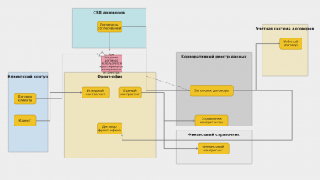
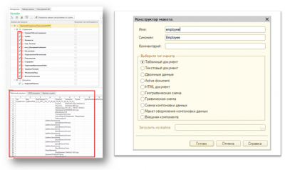
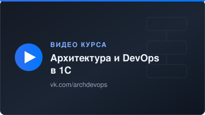

# Роман Кузин

  
  
  
  

### О себе

- Enterprise-архитектор: прошел путь от стажера-разработчика 1С до корпоративного архитектора
- Проектирую архитектуру 1С-ландшафта и выстраиваю DevOps-практики в командах
- Автор и преподаватель курса «Архитектура и DevOps в 1С»
- Спикер Инфостарт

### Полезное

- [Архитектура и DevOps в 1С](https://archdevops.ru) — курс для разработчиков, тимлидов и архитекторов
- [Телеграм-канал курса](https://t.me/kurs1c_architect) — анонсы, разборы, материалы
- [Сообщество ВКонтакте](https://vk.com/archdevops) — видео по темам курса
- [DB-Orchestrator](https://github.com/KuzinRoman/DB-Orchestrator) — пайплайн резервного копирования и восстановления БД: 1С, MSSQL, PostgreSQL
- [Юнит-тестирование на YAxUnit](https://github.com/KuzinRoman/yaxunit) — репозиторий урока с курса
- [ArchiMate для 1С](https://github.com/KuzinRoman/archimate_1C) — визуализация процессов и компонентов в Archi
- [Примеры ADR](https://github.com/KuzinRoman/ADR) — как фиксировать архитектурные решения
- [GitLab: код и команды](https://github.com/KuzinRoman/gitlab) — презентация с примерами по курсу

 

## Стек

### Архитектура

### Платформа и языки

### CI/CD

### Тесты, интеграции, мониторинг

## Выступления на конференциях

<table>
  <tr>
    <td width="33.33%" valign="top" align="center">
       
      <b>Инфостарт · Как построить корпоративную архитектуру на 400 интеграций и 300 систем</b> 
      <a href="https://infostart.ru/pm/2628324/">Статья</a>
    </td>
    <td width="33.33%" valign="top" align="center">
       
      <b>Инфостарт · Повышаем надежность интеграций с RabbitMQ: контрактные тесты в несколько кликов</b> 
      <a href="https://infostart.ru/1c/articles/2450388/">Статья</a>
    </td>
    <td width="33.33%" valign="top" align="center">
       
      <b>Курс «Архитектура и DevOps в 1С» · все видео</b> 
      <a href="https://archdevops.ru">archdevops.ru</a>
    </td>
  </tr>
</table>

## Активность

<picture>
  <source media="(prefers-color-scheme: dark)" srcset="https://raw.githubusercontent.com/KuzinRoman/KuzinRoman/output/github-contribution-grid-snake-dark.svg"/>
  
</picture>

